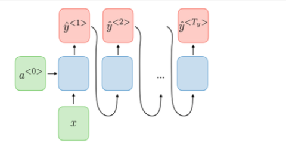

# ChinesePoemGeneration

# 效果

* 五言绝句

>  玉照上阳宫，清秋凝素风。日寒人未到，云尽雁还来。

* 七言绝句

> 月落寒天末风清，夜深吹落向南平。故人世乱唯应见，此夕空流万里情。

* 藏头诗（小鸟依人、我爱调参）

> 小径微凉风，鸟来林下生。依稀有相思，人事竟无情。

> 我有相思物，爱君花下衣。调琴一别曲，参差不见稀。

# 系统简介

利用深度学习自然语言处理模型，学习《全唐诗》所录诗歌，自动创作符合要求的绝句诗歌

### 系统功能

* 五言诗生成：无输入，自由发挥创作五言诗

* 七言诗生成：同上

* 藏头诗生成：根据用户输入的1~4个字，生成对应的藏头五\七言诗

使用了循环神经网络（GRU）和position embedding生成古诗。输入第一个汉字，生成剩余诗句，并且在生成过程中依概率在topk中选字。

# 模型介绍

## 框架模型：GRU+MLP

* GRU是RNN的一种，用以处理和生成序列。是对LSTM的改进，使用同一门控控制遗忘和记忆，有更高的训练效率。

* 将GRU每一步得到的结果再通过一个输入为GRU的隐状态维数，输出为字典维度的MLP，并通过softmax归一化为概率。

## 训练过程

* 我们认为诗歌的生成过程是auto-regressive的，即每一个字的生成概率仅与前面的内容有关。因此使用前面基于循环神经网络的方法建模。

  

* 训练时，我们使用了teacher forcing的方法：即输入首字，并将模型输出与真实的第二字对比计算交叉熵损失；输入真实的第二字，并将模型的输出与真实的第三字对比……

* 生成时，通过给定的每句首字（未给定则依首字频率采样），通过如图所示的传统步骤生成诗歌。我们用位置向量来确定句子位置。

## 汉字和位置嵌入

### word embedding 方法

将字视为向量，在高维空间中使不同字的意义能够充分体现

采用在《四库全书》上预训练的embedding，生成300维字向量。[《Analogical Reasoning on Chinese Morphological and Semantic Relations》](http://aclweb.org/anthology/P18-2023)

### position embedding 方法：

将字在句中的位置信息也作为特征，充分利用诗歌的格式要求

能够有效的提高诗句的整体性，降低断句错误发生的概率

采用[《Attention is All You Need》](https://papers.nips.cc/paper/7181-attention-is-all-you-need.pdf)中的方法，生成100维位置向量，输入时并（concatenate）到word embedding后。

